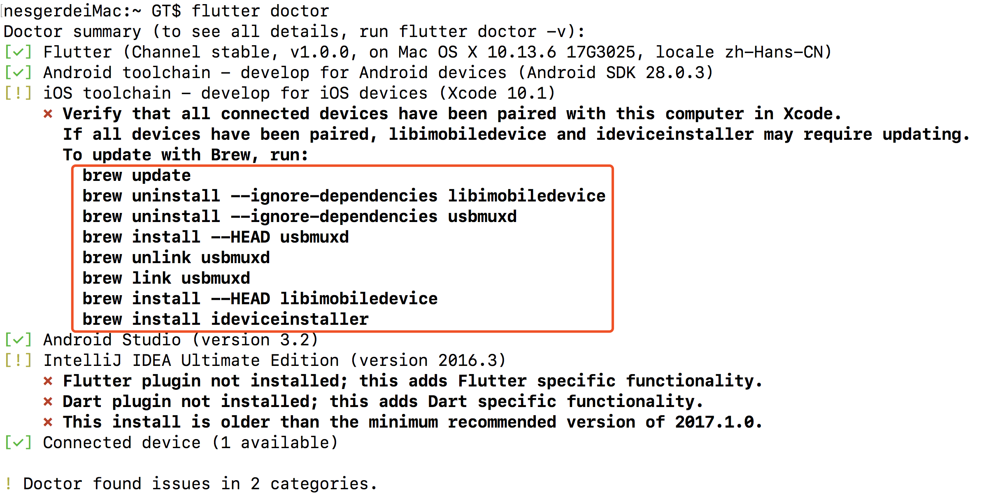

今天按照[FLutter中文网](https://flutterchina.club/)进行环境搭建。
比较经常使用的命令就是
```
flutter doctor
```
然后出现了一个问题

记得一开始一条命令一条命令去执行时还是有问题，所以干脆一次性执行，用;分隔，结果👌了。
```
brew update;brew uninstall --ignore-dependencies libimobiledevice;brew uninstall --ignore-dependencies usbmuxd;brew install --HEAD usbmuxd;brew unlink usbmuxd;brew link usbmuxd;brew install --HEAD libimobiledevice;brew install ideviceinstaller
```
